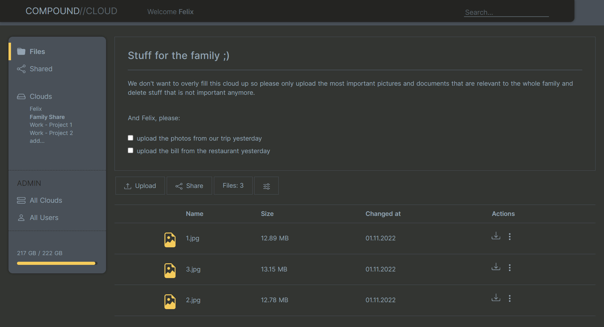

<h3 align="center"></h3>
<h1 align="center">CompoundCloud</h1>

* * *

### *So... what is CompoundCloud?*

Imagine Websites - you just type in www.anything... and the website is there.

So why not the same thing with Filestorage Clouds?: **Just type in the name of a Cloud and the files are there**... as simple as that... wherever you are...

**No long authentiation process** (although that's possible for private clouds).

Because: No one will know that you have **your own Fileserver (how cool is that!)** anyways... unless you want it:

Share your cloud to hundreds... in only seconds - just let a whole room scan your **QR-Invitation-Code** that every cloud has.

* * *

### *Want to know more? Have a look at this:*


### The whole awesomeness:

##### File sharing/accessing actually made easy
* QR-Code Sharing
* Open Clouds with just the name of it
* Save multiple clouds to a User 
  * (and close them again like browser-tabs)

##### Customization? Yes please!
* Cloud Descriptions
* Dark-Mode & Light-Mode

##### Public and private Clouds
* Cloud creation in 5 seconds
  * (no login for public clouds needed)
* Private Clouds that only a logged-in Member can open

##### Unlimited storage* - (as much as you have on your drives)
* Connect your own Drives
  * (changable Storage Location)

* * *

# How to get it?

## Step 1 - Install CompoundCloud

### Run as a Docker Container (recommended)

```bash 
# Installation
$ docker pull redevised/compoundcloud

# Start the Server with
$ docker run -d -p 5000:5000 --name CompoundCloud redevised/compoundcloud
```

### Work directly with the code

```bash
# Installation
$ git clone https://github.com/re-devised/CompoundCloud.git
$ cd CompoundCloud
$ npm install
$ npm run build

# If you want to use the cloud, start the Production Server with
$ npm run start

# If you want to change the code up, run in Development with
$ npm run dev
```

CompoundCloud can then be accessed at [http://localhost:5000](http://localhost:5000) on your host system. To access it outside of your network you have to port-forward the application on your router.

## Step 2 - Connect to Database

CompoundCloud needs to be connected to a MongoDB Database to work properly. To achieve that you can run a Mongo-Instance inside a Docker Container and create a Network with the CompoundCloud-Container or connect to an external Mongo-Database like the ones from [MongoDB-Atlas](https://www.mongodb.com/atlas).

For secure connections the Environment Variables MONGO_USERNAME and MONGO_PASSWORD can be passed through to the CompoundCloud Instance.

### Run a Mongo Docker Container

```bash 
# Installation
$ docker pull mongo

# Run Mongo and connect it to the CompoundCloud Network
# (You might need to start CompoundCloud again 
# since it stops when no connection to a Database could be build up.)
$ docker run -d --network container:CompoundCloud mongo
```

### Connect to external Database

```bash 
# Run CompoundCloud with connection details (Environment Variables)
$ docker run -d -p 5000:5000 -e MONGO_URL=yourdb.mongodb.net -e MONGO_USERNAME=username -e MONGO_PASSWORD=password --name CompoundCloud redevised/compoundcloud
```

# All Settings
## Environment Variables

* **BASE_URL** (eg: https://myowncloud.com | default: http://localhost:5000) : change if you want to use the app outside of your own network and access it with your own domain.
* **PORT** (eg: 7000 | default: 5000) : change to let the server run on a different port than 5000. Remember to also forward the new port outside the container with "-p 7000:7000".
* **MONGO_URL** (eg: yourdb.mongodb.net | default: mongo:27017) : change to connect to a MongoDB Database outside of the CompoundCloud network.
* **MONGO_USERNAME** (eg: username | default: Undefined) : change to connect to a secured MongoDB Database.
* **MONGO_PASSWORD** (eg: password | default: Undefined) : change to connect to a secured MongoDB Database.
